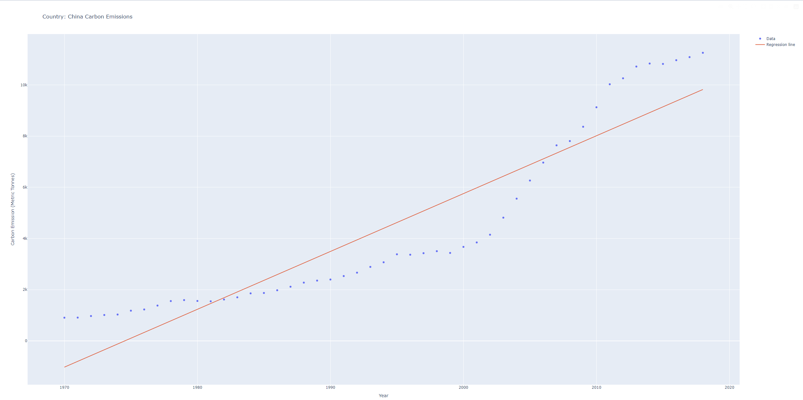
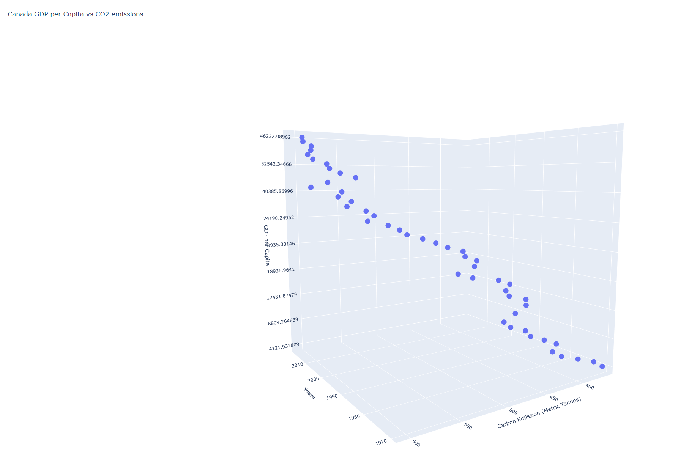

# Carbon Emissions and GDP Analysis

This project analyzes and visualizes carbon emissions and GDP data using Python. It includes functions for extracting and formatting data, calculating regression models and errors, and creating both 2D and 3D graphs.

## Features

- **Data Extraction:** Extracts data from CSV files.
- **Regression Analysis:** Performs linear and polynomial regression.
- **Error Calculation:** Computes Root Mean Squared Error (RMSE) for regression models.
- **Graphing:** Creates 2D plots with Matplotlib and interactive 3D scatter plots with Plotly.

## Tech Stack

- **Backend**: Python
- **Libraries/Tools**:
  - NumPy
  - Plotly

## Prerequisites

- Python 3.x
- pip install plotly

### Linear Regression of China's Carbon Emissions

This plot shows the linear regression of China's carbon emissions from 1970 to 2018.

### 3D Plot of Canada's GDP per Capita vs CO2 Emissions

This 3D scatter plot illustrates the relationship between Canada's GDP per capita, CO2 emissions, and years.

